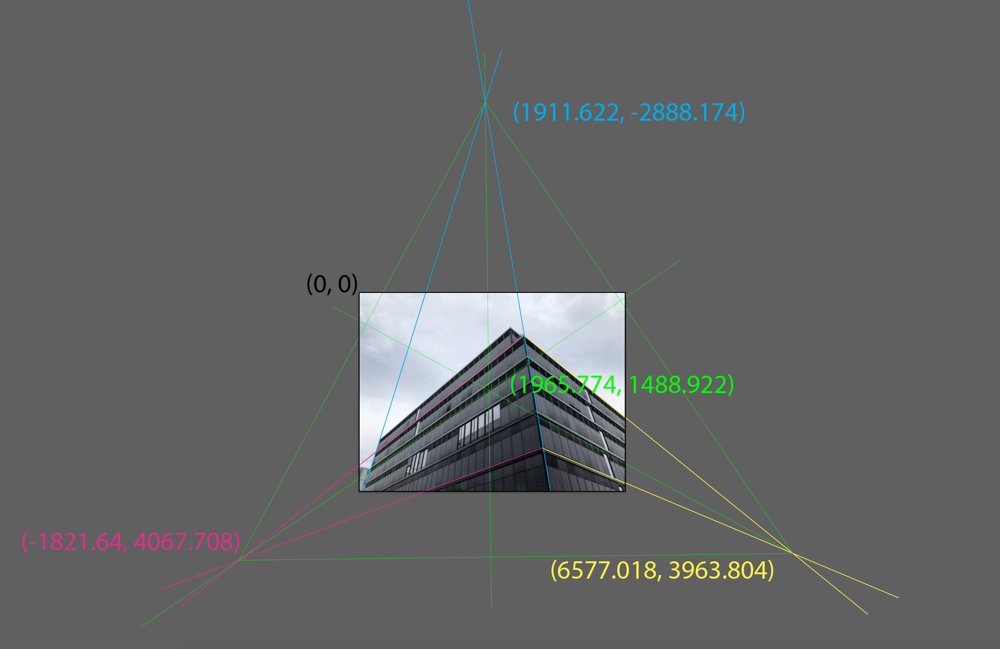

# Assignment 1 Documentation

## Task 1

Noticing the URL in the image on the Assignment pdf, I realized that the message had something to do with color conversions.

I actually first used Photoshop's Channel Mixer, Levels, and Curves to fiddle around with the image's color and contrast settings.


Then I used opencv/numpy/PIL/matplotlib python libraries to "do the same thing with code." Task 1's code is in the task_1 folder. Results are below:


## Task 2


Vanishing points and the principal point were both found using Adobe Illustrator, which reports pixel locations of line intersections and allows for rotating lines 90 degrees.  

3D parallel lines were drawn (cyan, magenta, yellow lines) and intersection coordinates recorded for each of the 3 vanishing points. The principal point was found (green lines), knowing the orthocenter of the triangle formed by the 3 vanishing points would be the principal point of the image.



These coordinates were then fed into the focal length formula derived in class for three vanishing points (see task_2/task_2.py code).


Output from the code provides the final calibration matrix. It also confirms the derivation since the focal length is the same regardless of which pairs of vanishing points is used.

```
Focal Length, f= 3329.039529317728 (points 1 and 2)
Focal Length, f= 3329.0387546203183 (points 2 and 3)
Focal Length, f= 3329.0385763051772 (points 1 and 3)

Calibration Matrix:
[[3.32903953e+03 0.00000000e+00 1.96577400e+03]
 [0.00000000e+00 3.32903953e+03 1.48892200e+03]
 [0.00000000e+00 0.00000000e+00 1.00000000e+00]]
```
