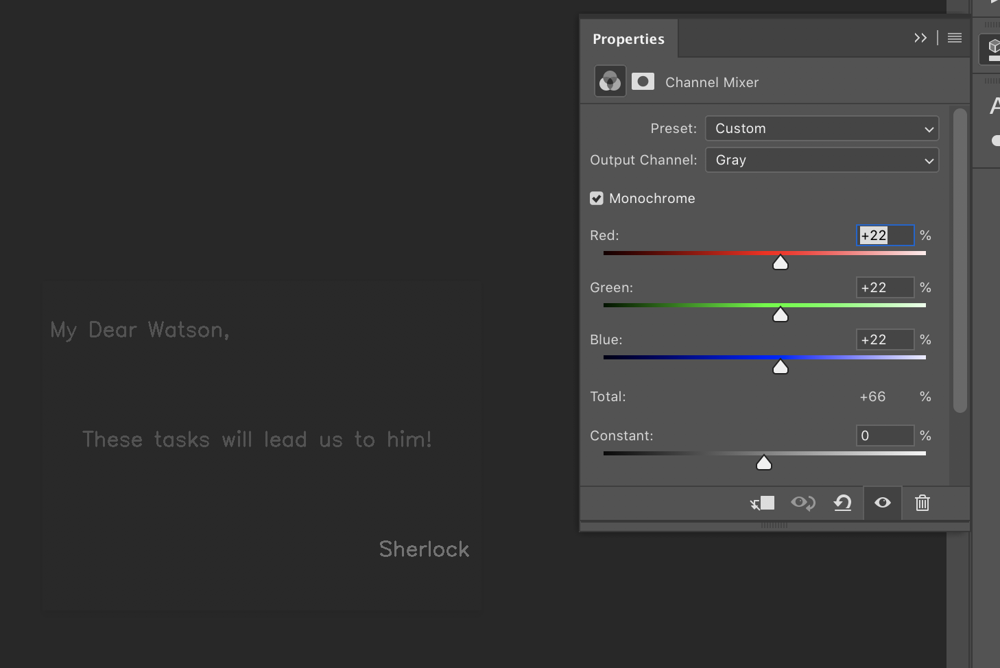
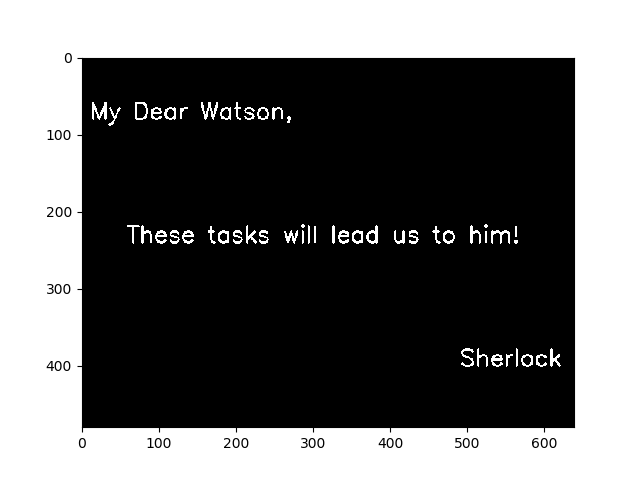

# Assignment 1 Documentation

## Task 1

Noticing the URL in the image on the Assignment pdf, I realized that the message had something to do with color conversions.

I actually first used Photoshop's Channel Mixer, Levels, and Curves to fiddle around with the image's color and contrast settings.

Then I used opencv/numpy/PIL/matplotlib python libraries to "do the same thing with code." Task 1's code is in the task_1 folder. Results are below:

