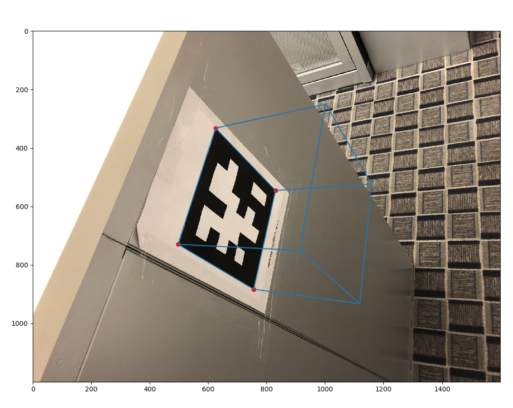

# Assignment 1 Documentation

## Code Compilation/Run

### Packages/Environments

Tasks 3 and 4 make use of pyAprilTag, which seems to only be usable in Anaconda prompt with the following Anaconda environment setup:

```
conda create --name opencv_py37 python=3.7 numpy matplotlib cython
conda activate opencv_py37
conda install -c conda-forge opencv=3.4.7
```

Once the above environment is activated, the directory can be changed back to this assignment's within Anaconda Prompt.

pyAprilTag can then be installed with these [instructions](https://gist.github.com/simbaforrest/ed0447c66f6e97b66d0850645c0b1266#file-apriltag-demo-md).

Other packages used can be installed using pip and the requirements.txt file (type `pip install requirements.txt`)

### Task Folder Structure
Code has been divided into project folders. So for task 'X', change directory to the corresponding folder, then run `python task_X.py`

## Task 1

Noticing the URL in the image on the Assignment pdf, I realized that the message had something to do with color conversions.


I actually first used Photoshop's Channel Mixer, Levels, and Curves to fiddle around with the image's color and contrast settings.


Then I used opencv/numpy/PIL/matplotlib python libraries to "do the same thing with code." Task 1's code is in the task_1 folder. Results are below:


## Task 2


The above image (4032px by 3024px) was used for task 2. Vanishing points and the principal point were both found using Adobe Illustrator, which reports pixel locations of line intersections and allows for rotating lines 90 degrees.  

3D parallel lines were drawn (cyan, magenta, yellow lines) and intersection coordinates recorded for each of the 3 vanishing points. The principal point was found (green lines), knowing the orthocenter of the triangle formed by the 3 vanishing points would be the principal point of the image.


Of note is the fact that the principal point (1965, 1488) is roughly equal to the center of the image (2016, 1512).

These coordinates were then fed into the focal length formula derived in class for three vanishing points (see task_2/task_2.py code).


where vanishing points are (u1, v1) and (u2, v2) and the principal point is (x0, y0).

Output from the code provides the final calibration matrix. It also confirms the derivation since the focal length is the same regardless of which pairs of vanishing points is used.

```
Focal Length, f= 3329.039529317728 (points 1 and 2)
Focal Length, f= 3329.0387546203183 (points 2 and 3)
Focal Length, f= 3329.0385763051772 (points 1 and 3)

Calibration Matrix:
[[3.32903953e+03 0.00000000e+00 1.96577400e+03]
 [0.00000000e+00 3.32903953e+03 1.48892200e+03]
 [0.00000000e+00 0.00000000e+00 1.00000000e+00]]
```

## Task 3

Using the same iPhone, I took a photo of the AprilTag calibration image:

 

and obtained the following calibration matrix:
```
camera intrinsic matrix:
[[3.21246201e+03 0.00000000e+00 2.03445914e+03]
 [0.00000000e+00 3.21364362e+03 1.47598821e+03]
 [0.00000000e+00 0.00000000e+00 1.00000000e+00]]
camera distortion parameters:
[ 2.59008451e-01 -1.46912312e+00 -1.75916904e-03  1.17038348e-03
  0.00000000e+00]
```

Pretty close to what I got by hand in Task 2! Of course I didn't get any distortion parameters. Noticing that one of the AprilTags wasn't recognized in the above image, I took a second one and reran the demo_calib_by_photo script:

 

```
camera intrinsic matrix:
[[3.14072514e+03 0.00000000e+00 2.01964606e+03]
 [0.00000000e+00 3.14336567e+03 1.48452385e+03]
 [0.00000000e+00 0.00000000e+00 1.00000000e+00]]
camera distortion parameters:
[ 2.39702854e-01 -1.11168603e+00  7.30426899e-04  4.52920808e-04
  0.00000000e+00]
```

The results are slightly different from the first calibration image. The second calibration may be the most accurate, since the estimated principal point is closer to the center of the image (2016px, 1512px). I also highly suspect differences may result from the iPhone's autofocus, which would vary the focal length between images outside of my own control. I purposely tried to stand farther back in the second calibration image, hoping to get something closer to my own image in Task 2 where I also stood far away from the object.

Moreover, I think discrepancies result from my hand drawn lines and vanishing points in Task 2. While it's sort of "comforting" to do things yourself step by step, I also think doing things by hand may be more susceptible to errors. Though I use Illustrator software, my results in Task 2 may be very sensitive to where I visually estimate the 3D parallel lines to be, subsequently propagating error into vanishing point coordinates and calibration calculations.


## Task 4
pyAprilTag.find() doesn't seem to work with large image files (4032px x 3024px). So for Task 4, photos taken from the iPhone were resized to 1600px by 1200px. Also knowing from Task 3 that the iPhone's autofocus had an effect on the calibration, an iPhone camera app was used to turn off the camera's auto focus. A calibration image was retaken and calibration matrix recalculated.

Calibration images:

 

Calibration matrix:
```
[ [1.17136545e+03, 0.00000000e+00, 8.01203424e+02],
  [0.00000000e+00, 1.17497866e+03, 5.38637778e+02],
  [0.00000000e+00, 0.00000000e+00, 1.00000000e+00]]
```
With manual focus kept at the same focal length, a photo was taken of an AprilTag. Both AprilTag image and calibration image were of size 1600px by 1200px.

Once the full 3D perspective projection matrix was calculated, world coordinates of the cube's corners could be transformed into corresponding image coordinates. Lines can then be drawn to form the 3D cube on the image.


Other angles can be taken as well:




(note: these are taken at different focal length, but use the same K matrix as above. Technically this means the cubes' are somewhat "incorrect" but the errors are not very noticeable)

Example output for Task 4 code:
```
K =
[[1.17136545e+03 0.00000000e+00 8.01203424e+02]
 [0.00000000e+00 1.17497866e+03 5.38637778e+02]
 [0.00000000e+00 0.00000000e+00 1.00000000e+00]]

H =
[[ 1.37289126e+02 -5.25032240e+01  7.73175264e+02]
 [-1.66553793e+01 -1.43641780e+02  5.50344233e+02]
 [ 5.93427257e-02 -4.91402615e-02  9.80901409e-01]]

Corner Image Coordinates =
[[709.16875496 732.09247473]
 [883.95576143 621.75540286]
 [865.66220625 393.54812803]
 [668.6962352  485.26924922]]

A = K^-1 * H =
[[ 0.07661446 -0.01121074 -0.0108645 ]
 [-0.04137915 -0.0997235   0.01871836]
 [ 0.05934273 -0.04914026  0.98090141]]

Translation =
[-0.10310473  0.1776383   9.30880808]

R Matrix =
[[ 0.72707541 -0.10639057  0.71609828]
 [-0.39269036 -0.94638143  0.27915157]
 [ 0.56316572 -0.46634377 -0.72986922]]

Extrinsics [ R | t ] =
[[ 0.72707541 -0.10639057  0.71609828 -0.10310473]
 [-0.39269036 -0.94638143  0.27915157  0.1776383 ]
 [ 0.56316572 -0.46634377 -0.72986922  9.30880808]]

Camera Matrix K * [ R | t ] =
[[ 1.30288132e+03 -4.98258470e+02  2.54039063e+02  7.33747559e+03]
 [-1.58060461e+02 -1.36316836e+03 -6.51380021e+01  5.22279691e+03]
 [ 5.63165717e-01 -4.66343772e-01 -7.29869223e-01  9.30880808e+00]]

World Coordinates =
[[ 1  1  0  1]
 [-1  1  0  1]
 [-1 -1  0  1]
 [-1 -1  2  1]
 [-1  1  2  1]
 [ 1  1  2  1]
 [ 1 -1  2  1]
 [ 1 -1  0  1]]

Image Coordinates =
[[8.65662206e+02 3.93548128e+02 1.00000000e+00]
 [6.68696235e+02 4.85269249e+02 1.00000000e+00]
 [7.09168755e+02 7.32092475e+02 1.00000000e+00]
 [9.08243795e+02 8.53139630e+02 1.00000000e+00]
 [8.86334865e+02 5.70038672e+02 1.00000000e+00]
 [1.08863511e+03 4.49451399e+02 1.00000000e+00]
 [1.08651321e+03 7.09305928e+02 1.00000000e+00]
 [8.83955761e+02 6.21755403e+02 1.00000000e+00]]
```

## Task 5

Using RANSAC, the best fit plane found for the given point cloud data is shown below:


This was found using the following RANSAC parameters:
 - Number of Trials: 3
 - Score Threshold: 217586 (80% of total points)
 - Initial Sample Size: 5 points  

A threshold score of 80% of total points (217586) was found to be best for finding a plane quickly. Any higher threshold took much longer to "converge."

The following are visualizations of the trial results:


As indicated in bold in the figure above, Trial 1 had the best score and it's consensus and sample sets were combined to find the final plane model shown in the previous figure.

Terminal output from Task 5 code can be found below:
```
geometry::PointCloud with 271983 points.
Threshold Score: 217586
Simple Plane: Plane(Normal: [0.0989,0.7981,0.5943], Point: [0.0235,0.1073,0.7368])
Trial: 0, Score: 220615
Trial Done?: True

---

Trial: 0, Final Score: 220615

---

Simple Plane: Plane(Normal: [0.0714,0.8767,0.4757], Point: [-0.037,-0.286,1.1162])
Trial: 1, Score: 5693
Trial Done?: False

---

Simple Plane: Plane(Normal: [-0.2922,0.7857,0.5453], Point: [-0.2307,-0.1265,0.9684])
Trial: 1, Score: 18319
Trial Done?: False

---

Simple Plane: Plane(Normal: [0.1011,0.8027,0.5877], Point: [-0.1043,-0.0138,0.9226])
Trial: 1, Score: 221668
Trial Done?: True

---

Trial: 1, Final Score: 221668

---

Simple Plane: Plane(Normal: [0.1554,0.7795,0.6068], Point: [0.004,-0.0795,0.9766])
Trial: 2, Score: 99349
Trial Done?: False

---

Simple Plane: Plane(Normal: [0.0945,0.7849,0.6123], Point: [0.0906,-0.1731,1.0934])
Trial: 2, Score: 186135
Trial Done?: False

---

Simple Plane: Plane(Normal: [0.1026,0.7974,0.5947], Point: [0.0256,0.0904,0.7564])
Trial: 2, Score: 217380
Trial Done?: False

---

Simple Plane: Plane(Normal: [-0.1579,0.7737,0.6136], Point: [0.0239,-0.0472,0.8572])
Trial: 2, Score: 27537
Trial Done?: False

---

Simple Plane: Plane(Normal: [0.1069,0.8028,0.5866], Point: [0.1012,-0.0433,0.9274])
Trial: 2, Score: 221111
Trial Done?: True

---

Trial: 2, Final Score: 221111

---

Final Results

Trial: 0, Final Score: 220615, Model Plane: Plane(Normal: [0.0989,0.7981,0.5943], Point: [0.0235,0.1073,0.7368])
Trial: 1, Final Score: 221668, Model Plane: Plane(Normal: [0.1011,0.8027,0.5877], Point: [-0.1043,-0.0138,0.9226])
Trial: 2, Final Score: 221111, Model Plane: Plane(Normal: [0.1069,0.8028,0.5866], Point: [0.1012,-0.0433,0.9274])

Best Trial: 1, Final Score: 221668
Final Plane: Plane(Normal: [0.1029,0.8016,0.5889], Point: [0.022,0.0157,0.8601])
```
# References
https://github.com/ai4ce/pyAprilTag
